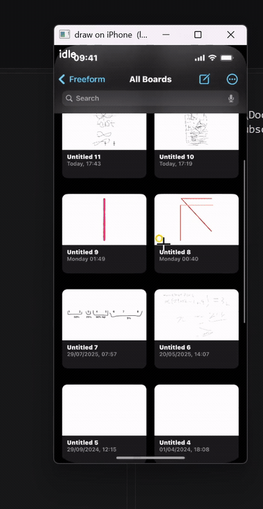

# WinBleTouch

**Windows-native BLE HID touchscreen digitizer for iOS, using absolute touch coordinates — no AssistiveTouch, no cursor.**

**WinBleTouch is a .NET Windows program** (`Program.cs`, run with `dotnet run`) that makes your PC act as a Bluetooth Low Energy touchscreen digitizer, using `GattServiceProvider`.

While it runs, it exposes a local TCP command interface on `127.0.0.1:8760`. Any other program or script connects there and sends absolute touch input, which WinBleTouch relays to the paired iPhone/iPad as BLE HID reports.

It uses the normal Windows Bluetooth stack, so there's no driver takeover and no exclusive control of the adapter. Each GATT service runs independently, and the HID service can start or stop without interrupting other Bluetooth connections.

`winbletouch.py` is a tiny Python client for that TCP interface, but it isn't required — anything that can open a socket can drive it.

## Requirements

- Windows 10/11 with a Bluetooth adapter that supports the **LE peripheral role** (most built-in and USB BT 4.0+ adapters do; the probe below tells you).
- .NET SDK 10+ (project targets `net10.0-windows10.0.22621.0`).
- An iPhone/iPad to pair with, with **Accessibility > Zoom** enabled — see below.

## iOS setup

On iOS, an unpaired BLE digitizer's reports are ignored unless an accessibility touch path is active. **Accessibility > Zoom** provides one:

1. **Settings > Accessibility > Zoom > On.**
2. **Zoom Region:** Full Screen. **Zoom Filter:** None. **Zoom Controller:** Off. (These are the defaults — nothing to change.)
3. The screen zooms in at first. Triple-tap with three fingers to open the Zoom menu, then drag the magnification slider all the way down to 1x. At 1x, screen coordinates map 1:1.

At 1x with the controller off there is no lens, no floating button, and no cursor — nothing on screen. AssistiveTouch is **not** used or required. Turning Zoom back off stops touches being delivered.
Verified on stock, non-jailbroken **iOS 18.6.2** (iPhone 14), **iOS 26.6** (iPhone 16 Pro Max), and **iOS 17** (iPhone 13), Developer Mode on and off.

## Scope

Note this project is the **BLE HID transport only**. Its entire public surface:

| Call | Meaning |
|---|---|
| `contact(x, y)` | send/update the active absolute contact |
| `release()` | release the active contact |

**Coordinate contract:** `x`, `y` are absolute HID coordinates in `0..10000` (`0,0` = top-left of the digitizer surface, `10000,10000` = bottom-right); out-of-range is clamped.

Taps, holds, drags, freehand strokes, gesture recognition, and app logic are all yours — the library only streams contacts. A tap is `contact` then `release`; a drag is `contact` repeatedly then `release`. Single contact only — no multi-finger gestures.

## Make your own mapper

I myself don't know what mirroring/streaming wrapper you're using, be it:

**USB**: iPhoneMirror / IosScreenCaptureTool
**Wireless**: UxPlay / any AirPlay receiver
**Commercial/easy**: AirDroid Cast

Coordinate mapping is specific to that integration, and it's simple arithmetic: once you know the iOS screen bounds and the rectangle where the video is rendered, converting a pointer coordinate into the `0..10000` HID range is:

```python
# px,py = pointer in source pixels;  (l,t,r,b) = phone-screen rect in the source
nx = min(max((px - l) / (r - l), 0.0), 1.0)
ny = min(max((py - t) / (b - t), 0.0), 1.0)
hx, hy = round(nx * 10000), round(ny * 10000)     # then rotate if the source is
                                                  # rotated relative to the device
```

Whatever you use is responsible for that conversion. The library never sees it.

## Main Files

| File | Role |
|---|---|
| `Program.cs` | The component. GATT server + `contact`/`release`, exposed on a loopback control endpoint (`127.0.0.1:8760`, env `WINBLETOUCH_PORT`). Line protocol: `contact <x> <y>` / `release` / `status` / `ping`. |
| `winbletouch.py` | Minimal Python client — `WinTouch.contact(x, y)` / `.release()`. Import it, or use it as a template for a client in another language. |


## Run

```bash
dotnet run -c Release
```

On the iPhone/iPad, do the **iOS setup** above, then Settings > Bluetooth, pick this PC, and pair. **Accept the pairing prompt on *both* the PC and the iPhone** — Windows shows one too and it's easy to miss; if you only confirm on the phone, iOS connects but never subscribes.

Console should show `host SUBSCRIBED to input report`. Then drive it:

```bash
python winbletouch.py
```

Or from a headless run (`dotnet run` with redirected stdin), stream `contact`/`release` lines to the control endpoint.

### Probe mode

Runs setup only and prints one `[PROBE RESULT]` verdict (also the exit code):

```powershell
$env:WINBLETOUCH_PROBE=1; dotnet run -c Release # PowerShell
```
```bash
WINBLETOUCH_PROBE=1 dotnet run -c Release # bash
```


| Verdict | exit | Meaning |
|---|---|---|
| `NO_ADAPTER` | 2 | `BluetoothAdapter.GetDefaultAsync()` null — hardware/driver problem. Nothing about HID policy. |
| `NO_PERIPHERAL_ROLE` | 4 | Adapter present, can't be a BLE peripheral. |
| `HID_0x1812_DISABLED_BY_POLICY` | 3 | Windows blocks the HID service on this stack. |
| `HID_0x1812_PUBLISHED` | 0 | **Success.** |

## Findings

- `GattServiceProvider.CreateAsync(0x1812)` returns **Success** — HID is not policy-blocked. (Windows reserves DIS / GATT / GAP / Scan Parameters, not HID.)
- A fresh iPhone pairing reads HID Information + Report Map and **subscribes to the Input Report on the first connection**.
- With **Zoom on**, a 5-byte absolute stylus report is delivered to the foreground app as a real touch at the sent coordinates — holds, a 3×3 screen grid, and drags all landed within one physical pixel of the expected mapping on iOS 18.6.2 and 26.6. With **Zoom off**, all tested iOS versions ignore the same reports.
- `GattServiceProvider` gives no control over advertising flags / appearance / bonding parameters; pairing + encryption are OS-driven when iOS first reads the encrypted Input Report. One transient `[adv] Aborted` before `Started` is normal.
- Reserved-service behaviour and peripheral-role support are stack/adapter dependent — run the probe on your hardware.

## Optional future helpers (would ship separately, not in the core)

- In-range hover (`0x02`) as a distinct call.
- A coordinate-mapping helper library for common preview geometries.

## Demo



The GIF is from an earlier build. Preview smoothness is entirely down to your mirroring app and its capture path — WinBleTouch does no video. Touch latency is a separate, Bluetooth-LE concern and can still improve through hardware, firmware, or software optimizations, but the BLE connection interval itself is negotiated by iOS and cannot be directly tuned by WinBleTouch through `GattServiceProvider`.

## License

MIT — see [LICENSE](LICENSE).


----

Generative AI was used to correct the grammar in the content.
